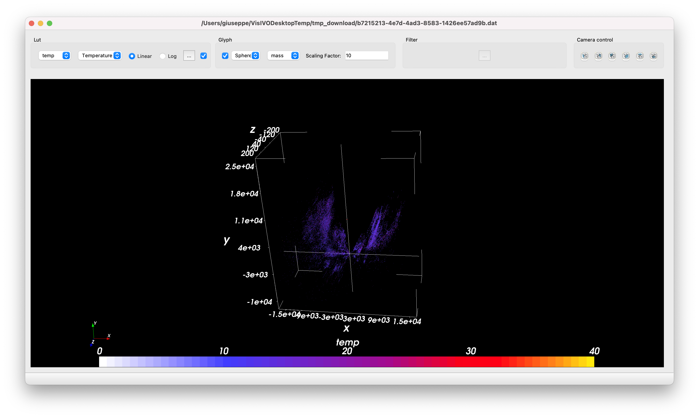

.. _3d-sources-sect:

3D visualization of compact sources
===================================
The 3D visualization can be performed by clicking on the :guilabel:`Select` button of the Main Window (see :numref:`main-window`) and then typing the region bounds (in degrees) of the area of interest.

.. _3d-sources:

    3D Visualization of sources on galactic plane

The 3D view is interactive and the camera position can be moved with mouse operations. The color palette can be mapped to a pre-defined field (e.g. temperature) in the :guilabel:`Lut` box in the top panel. The scale and range values can also be changed.

The shape and the scaling factor of each source can be modified in the :guilabel:`Glyph` panel. The points are scaled based on the selected field (e.g. mass). The maximum number of glyphs visualized is set in the Settings (:numref:`setting-window`).
