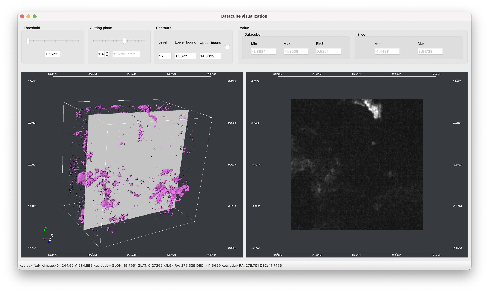
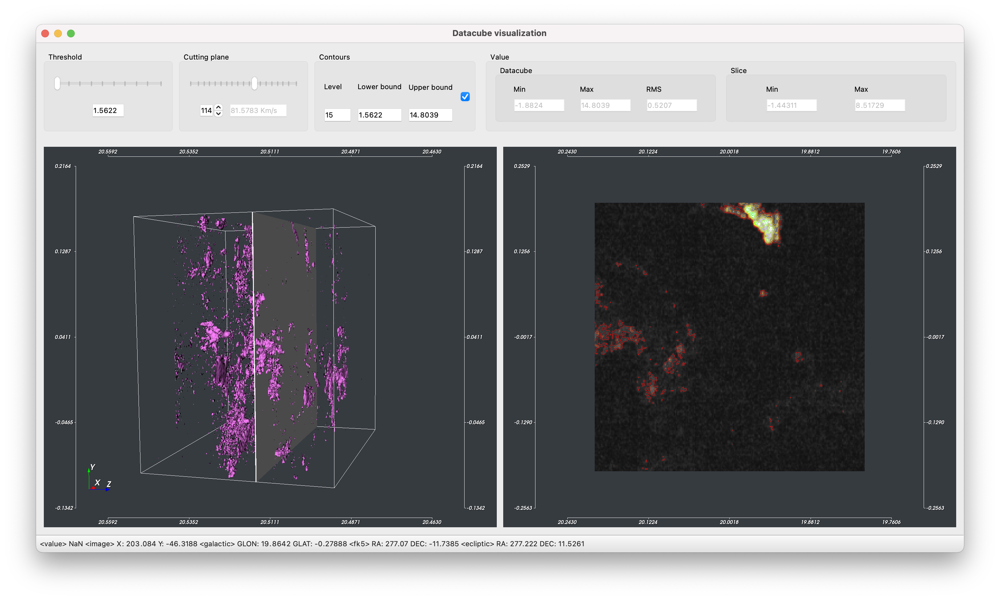

Datacube visualization
======================
When the user selects a datacube from the VLKB inventory, or when they load a datacube from their local disk, VLVA opens a new window to visualize datacube.

.. _dc:

    Datacube visualization

The 3D datacube visualization (left panel) can be controlled by the mouse movements. The camera can be reset to pre-defined views using the Camera Menu, e.g. :menuselection:`Camera --> Front` will place the camera in front of the datacube.

The 3D visualization can be zoomed with the mouse wheel and panned holding the :kbd:`SHIFT` key.

The datacube visualization is rendered using isosurfaces algorithm with the threshold specified by the :guilabel:`Threshold` slider located in the top panel.

The right panel shows a slice of the velocity datacube. The slice is selected using the :guilabel:`Cutting Plane` slider.

Any changes to these sliders will update the visualization in real-time.

Contrast and saturation of the visualized slice can be changed by holding the left mouse button and moving the cursor on the image. The bottom of the window shows the pixel value pointed by the mouse cursor, along with the coordinates expressed as pixel (X, Y), galactic (GLON, GLAT), fk5 (RA, DEC) and ecliptic (RA, DEC).

Isocontours
-----------
If the :guilabel:`Contours` checkbox is enabled, the isocontours are displayed on top of the selected slice as shown in :numref:`dc-contours`. The contours are also reported on the 2D map image. Contours settings can be modified by changing the :guilabel:`Level`, the :guilabel:`Upper bound` and :guilabel:`Lower bound` values.

.. _dc-contours:

    Contours visualization

Moment maps
-----------
VLVA allows to compute the zeroth and the first moment maps and visualize them as a new layer on top of the 2D image currently open. From the datacube window, the zeroth moment map is computed by clicking on the menu :menuselection:`Moment --> Calculate order 0`. The results is shown in :numref:`dc-moment`.

.. _dc-moment:

    Contours and zeroth moment map visualization on the 2D image