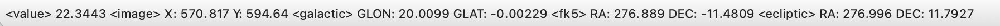
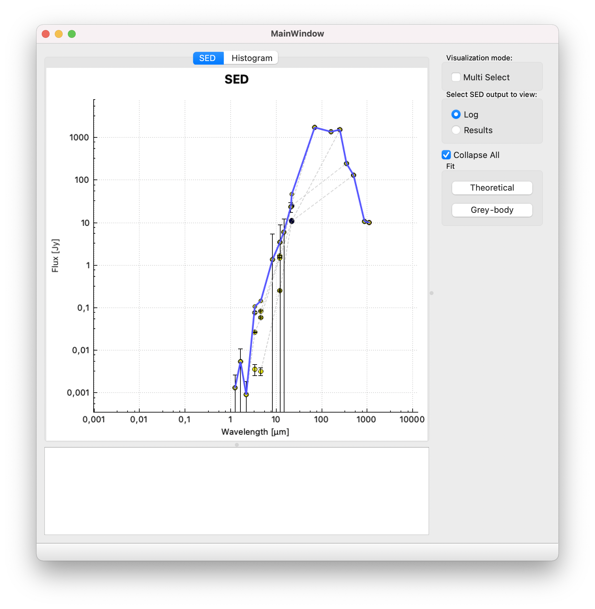

Image visualization
===================
Once the selected region has been downloaded or locally loaded from the Main Window, the 2D visualization window is shown.

By default, a grey color palette is used to visualize the image. The color palette can be changed using a predefined one embedded in the tool, for each of them is possible to select whether to use linear or logarithmic scale.

The image can be zoomed with the mouse wheel and panned dragging it when the :kbd:`SHIFT` button is pressed.

Contrast and saturation of the image can be changed by holding the left mouse button and moving on the image. The bottom of the window shows the pixel value pointed by the mouse cursor, along with the coordinates expressed as pixel (X, Y), galactic (GLON, GLAT), fk5 (RA, DEC) and ecliptic (RA, DEC) as shown in :numref:`coords`.

.. _coords:

    Information of the pixel pointed by the mouse cursor

On the top-right panel there is a list (following referred as VLKB inventory) of images and datacubes available in the ViaLactea Knowledge Base related to the visualized region. A single click on a inventory item shows a footprint on top of the visualized image to display the area covered by the item (:numref:`footprint`). The elements with a full overlap with the image can be recognized by the green background.

.. _footprint:
.. figure:: images/footprint.png
    :alt: Footprint

    Footprint visualization

Furthermore, the following operations can be carried out:

.. contents::
    :local:

Adding a new layer image
------------------------
A new layer image can be added by double-clicking a Continuum item on the VLKB inventory, or by loading a local file from the Main Window. In the latter case the image must be compatible, i.e. there must be an overlap among the images.

New layers are aligned (position, scaling pixel size, rotation) to the “image base” using the information contained in their header.

Each layer is listed in the bottom-right panel (see :numref:`img-layers`). This panel is organized as a reverse stack: the user eye is on the bottom of this stack and sees all activated layers by transparency. It is possible to move a layer up or down in the stack to change the visualization order.

The checkbox on the left of each row can activate or deactivate the visualization of the relative layer. The opacity, the color palette and the scale of each layer can be modified in the :guilabel:`Layer setting` panel located in the upper part of the window.

.. _img-layers:
.. figure:: images/layers.png
    :alt: Layers

    Visualization of several layers

Compact sources visualization
-----------------------------
VLVA allows to visualize compact sources overlapped to the fits image.

To query the VLKB for compact sources, click on the :guilabel:`Compact Source` button (or use the keyboard shortcut :kbd:`cmd ⌘` + :kbd:`R` on macOS system or :kbd:`ctrl` + :kbd:`R` on Linux) and make a rectangular selection of the region of interest on the visualized image.

VLVA extracts the coordinates from the selection and shows a window to query the VLKB (see :numref:`query-compact-sources`). 

By default, VLVA queries the VLKB to obtain sources from the bandmerged table. It is possible to download and visualize the compact sources of just one band by selecting the desired one from a dropdown list :guilabel:`Table` in the panel.

.. _query-compact-sources:
.. figure:: images/query_compact_sources.png
    :alt: Query Compact Sources

    Compact Source query window

The :guilabel:`Query` button sends the query to the VLKB and if there are any results, VLVA will automatically displays the compact sources on top of the image (see :numref:`img-compact-sources`).

.. _img-compact-sources:

    Visualization of compact sources retrieved from the VLKB

The compact sources are shown in different colors on the image depending on the relative wavelength. Similarly to the layers management, by using the checkbox it is possible to select which compact sources to display. It is also possible to change the color used to show the sources in the visualization by double-clicking on the colored rectangle of each row.

SED Analysis
^^^^^^^^^^^^
To perform SED analysis, from the menu bar go to :menuselection:`Window --> Select` (or use the keyboard shortcut :kbd:`cmd ⌘` + :kbd:`S` on macOS system or :kbd:`ctrl` + :kbd:`S` on Linux), select one or more of the visualized clumps and click on the :guilabel:`SED` button. Fit operations are performed in a transparent way for the user locally using integrated IDL routines or remotely. In the latter case, a Java JRE is required to communicate with the remote service.

There are three different kinds of fitting operations available, one for the fit with the theoretical models and two for the analytical fit. Fitting operations are performed from the menu bar selecting :menuselection:`Action --> Fit --> Theoretical model` or :menuselection:`Action --> Fit --> Grey-body`. It is also possible to perform the fitting operations by clicking on the buttons on the right panel (see :numref:`sed`).

.. _sed:

    SED plot

In case the SED presents multiple associations, it is possible to sum the fluxes of counterparts obtaining the SED with a cumulative flux. This operation is done by checking :guilabel:`Collapse All` from the right panel.

If the :guilabel:`Multi Select` visualization mode is activated, the fit operation is performed only on the selected nodes on the graph.

The bottom panel in this window shows either the output logs or the results of the SED fitting operation. A list of fits appears once a new fit is performed. Each one can be checked to show it on the plot. The :guilabel:`Clear All` button removes all the plotted fits (see :numref:`sed-plot-theor`).

.. _sed-plot-theor:
.. figure:: images/sed_plot_theor.png
    :alt: SED plot

    SED plot: in blue the theoretical fit performed on the selected SED

Filaments visualization
-----------------------
Similarly to the compact sources query, filament structures can be visualized by selecting the :guilabel:`Filaments` button on top of the window and making a rectangular selection.

The filaments are displayed with contour and spine on top of the image as shown in :numref:`img-filaments`. Their colors and visualization can be changed in the same way as the compact sources.

.. _img-filaments:

    Filaments visualization

