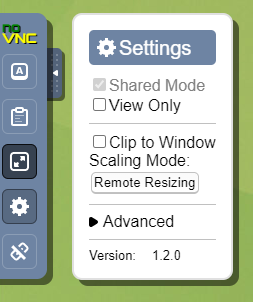
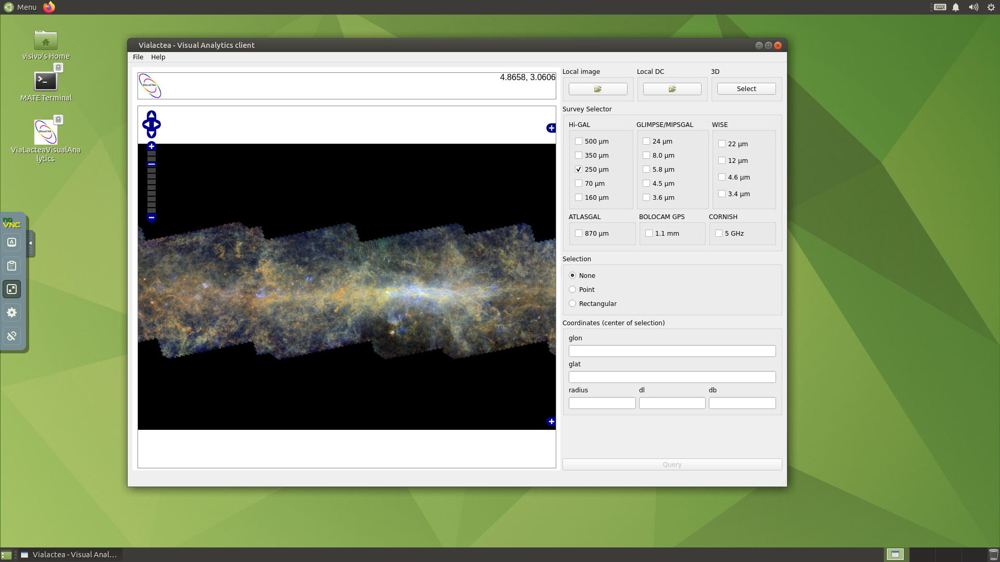

Installation
============
The source code of VLVA is available `here <https://github.com/NEANIAS-Space/ViaLacteaVisualAnalytics>`_.

DMG and Debian packages can be found in the `GitHub Releases page <https://github.com/NEANIAS-Space/ViaLacteaVisualAnalytics/releases>`_.

Docker container
----------------
VLVA is also available as a Docker container. The container leverages Virtual Network Computing (VNC) and can be easily accessed through a browser.

To start a new container, use the following command:

::

    $ docker run -it -e SIZEW=1920 -e SIZEH=1080 -e CDEPTH=24 -e SHARED=TRUE -e VNCPASS=vncpasswd -p 5901:5901 neaniasspace/vialacteavisualanalytics:latest

Then open a browser and go to http://localhost:5901/. The default password is "vncpasswd" (see the VNCPASS value in the Docker command).

Before starting VLVA change the scaling mode (:guilabel:`Settings` → :guilabel:`Scaling Mode` → :guilabel:`Remote Resizing`) and enable fullscreen (see :numref:`vnc-window`).

.. _vnc-window:

    VNC settings

Now you can start VLVA using the icon on the desktop.

.. _vialactea-docker:

    ViaLactea Docker container