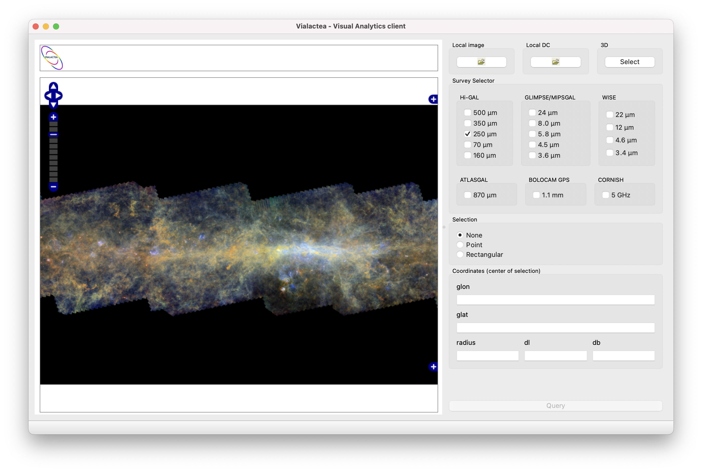

Main Window
===========
The Main Window shows an overview of a section of the galactic plane (longitude from -180° to +180° and latitude from -1° to 1°). This can be used from the user to perform a visual selection of the region of interest.

The selection of the region of interest can be carried out choosing a point on the map and specifying the radius of selection or picking up a rectangular region (see :numref:`main-window`). The maximum radius accepted by the Search&Cutout services is 2 degrees while the maximum sides [dl,db] is 1 degree.

The user can also select the surveys and wavelengths he is interested in by selecting the checkboxes on the right panel.

.. _main-window:

    Main window interface

Clicking on the :guilabel:`Query` button the tool will open on a separate window the FITS image containing the user selected region, in the chosen survey and wavelength, that is used as starting point for performing the visual analytic operations.

On top of the window there are three input buttons.
The tool allows the user to load an image that is locally stored by clicking on the :guilabel:`Local Image` button.
Moreover, the :guilabel:`Local DC` button allows the user to load and visualize a velocity datacube FITS file that is already stored on a local disk.
The :guilabel:`Select` button, under the 3D section allows the user to specify the range of coordinates on which to perform a 3D visualization of compact sources on the galactic plane.
