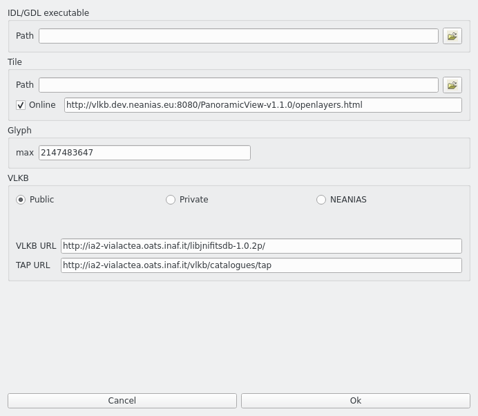

Set-up configuration
====================
At the first execution of VLVA, the user must setup the tool selecting :guilabel:`File` → :guilabel:`Settings` in the menu bar of the main window. 

The settings window (shown in :numref:`setting-window`) allows the user to setup the IDL or GDL path, i.e. select where the IDL/GDL binary executable is located (typically in macOS this path is :file:`/Applications/exelis/idl/bin/idl` and in Linux is :file:`/usr/local/bin/idl`).

The user must select the Tile path (where the :file:`openlayers.html` is located). The Tile path can be either local (on the user's computer) or remote. In the latter case the user should type the URL of the Tile path.

The user can also change the glyph max threshold for the 3D visualization mode. The default (and maximum) value for this option is 2147483647.

The last option concerns the VLKB access. The user has to select which VLKB instance the tool will connect to. If the user selects the private VLKB instance or the NEANIAS VLKB instance, the tool will prompt the user to log in to continue with the selected instance.
The private instance requires an username and a password.
The NEANIAS instance, instead, requires the user to login via the NEANIAS SSO page.
If the user selects the public VLKB instance, he does not need to log in but he will have restricted access to the VLKB catalogue.

The user can change these settings at any time.

.. _setting-window:

    Settings window

