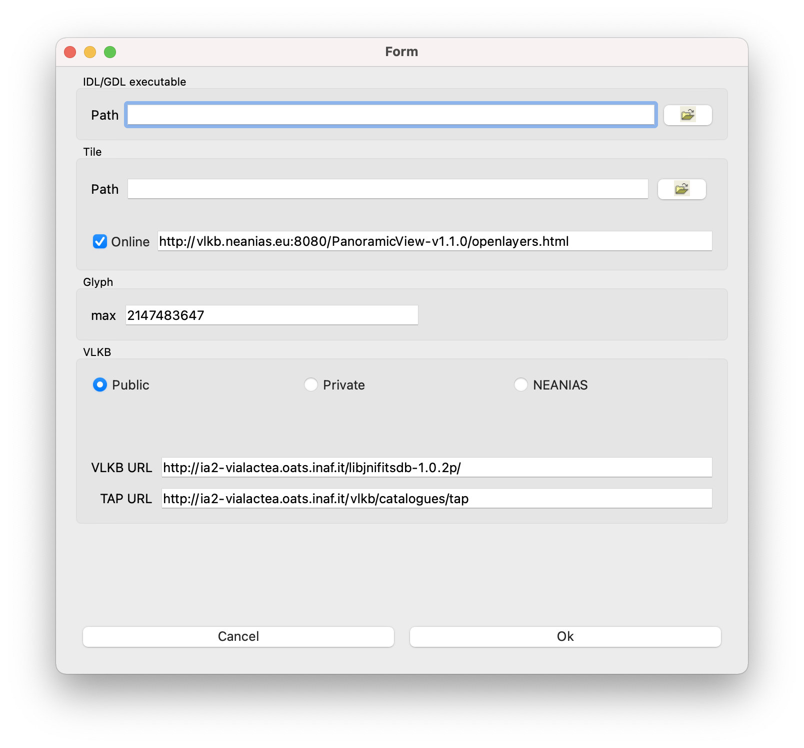

Configuration
=============
VLVA settings can be changed by selecting :menuselection:`File --> Settings` (:menuselection:`ViaLacteaVisualAnalytics --> Preferences` on macOS) in the menu bar of the main window. 

.. _setting-window:

    Settings window

:program:`IDL` (or :program:`GDL`) is needed to perform SED Fitting operations on the local machine. Typically in macOS the binary executable path is :file:`/Applications/exelis/idl/bin/idl`; in Linux is :file:`/usr/local/bin/idl`).

The Tile path is required to show the Galactic Plane view on the main window and it is the :file:`openlayers.html` absolute path. It can be either local (on the local computer) or remote. By default a URL of the Tile path is provided and enabled.

The glyph max value is used for the 3D visualization of compact sources. The default (and maximum) value for this option is 2147483647.

It is possible to select which VLKB instance the tool will connect to. Currently there are three active VLKB instances: the public access hosted at INAF-OATS, the private access also hosted at INAF-OATS, and the NEANIAS instance. By default, the public instance is selected.
The private and the NEANIAS instances are restricted to authenticated users.
The private instance requires an username and a password.
The NEANIAS instance, instead, requires the user to login via the NEANIAS SSO.

Users who want to use the NEANIAS instance must `request access <https://docs.neanias.eu/projects/s1-service/en/latest/services/vialactea.html#service-access>`_ to the service through the NEANIAS Service Management System.
