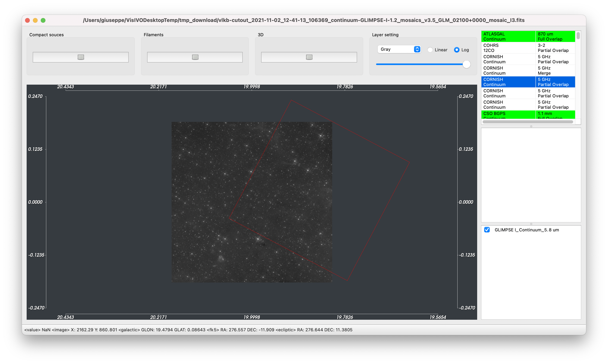
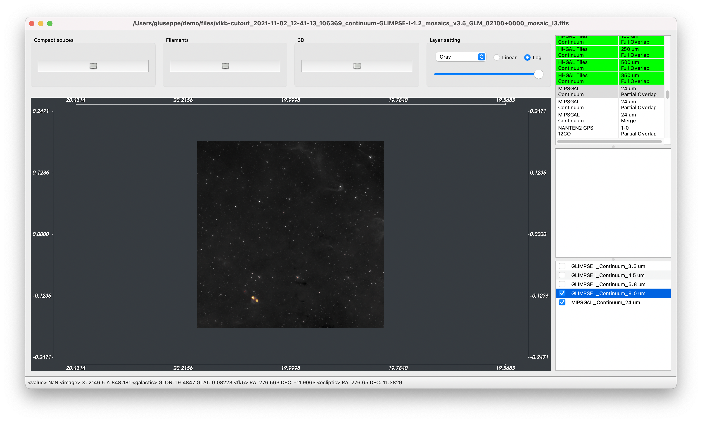
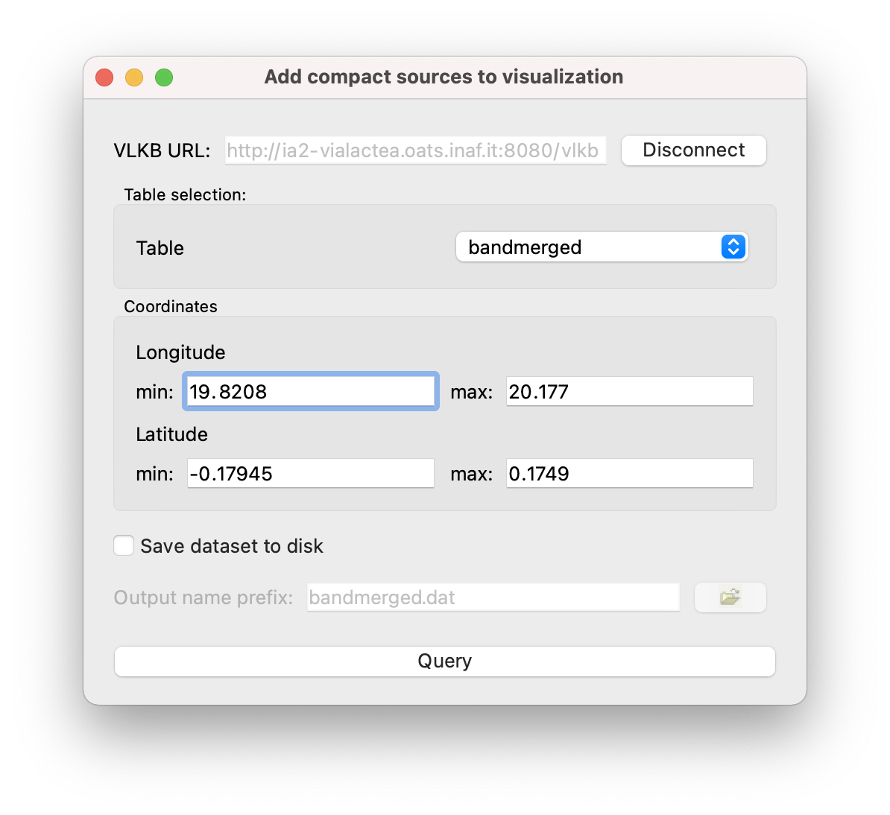

Maps visualization
=====================
Once the selected region has been downloaded or locally loaded from the Main Window, the 2D maps visualization window is shown.

The user can interact with the displayed image changing the palette used to map pixel values with colours. There is a set of predefined LUT embedded in the tool, for each of them is possible to select whether to use linear or logarithmic scale.

The image can be zoomed with the mouse wheel and panned dragging it when the :kbd:`SHIFT` button is pressed.

Contrast and saturation of the visualized image can be changed by keeping pressed the mouse left button and moving on the image. Passing the mouse over the image allows to display on the bottom of the window the pixel value, and coordinates expressed as pixel (X, Y), galactic (GLON, GLAT), fk5 (RA, DEC) and ecliptic (RA, DEC) as shown in :numref:`coords`.

.. _coords:
.. figure:: images/coords.png
    :alt: Coords

    Information of the pixel under the mouse cursor

If the visualized map is downloaded from the Search&Cutout service, on the right panel a list of 2D maps and datacube available in the ViaLactea Knowledge Base within the selected region are shown (following referred as VLKB items). To have an idea of the region covered by each of these elements a footprint is visualized if the users click on one of this item (:numref:`footprint`).

.. _footprint:

    Visualization of the footprint of selected item

Furthermore, the user can interact with the image performing the following operations:

    * :ref:`layers`
    * :ref:`compact-sources`
    * :ref:`filaments`
    * :ref:`datacube`
    * :ref:`3d-compact-sources`

.. _layers:

Add an image as a layer
-----------------------
Double clicking on one of the VLKB items, if it is a 2D map image, it is added as a new layer on top of the FITS images already displayed. The new layers are aligned (position, scaling pixel size, rotation) to the “image base” using the information contained in their header.

Each loaded layer is shown in the table (following referred as Layer items) in the bottom part of the right panel (see :numref:`img-layers`). Layer Items is organized as a reverse stack: the user eye is on the bottom of this stack and sees all activated layers by transparency. The user can move a visualized layer up or down in the Layer Items to change the visualization order.

Using the checkbox on the left of each row within the Layer items, the user can activate or deactivate the visualization of the relative layer. The opacity can be modified by selecting a row in the Layer items and using the slider in the :guilabel:`Layer setting` located in the upper part of the window.

.. _img-layers:

    Visualization of a new layer image

.. _compact-sources:

Compact sources visualization
-----------------------------
The user can display compact sources overlapped to the fits image.

.. _query-compact-sources:

    Adding compact sources from VLKB to visualization screen

If the user decides to retrieve compact sources dataset from the VLKB he should click on the :guilabel:`Compact Source` button (or use the shortcut :kbd:`cmd ⌘` + :kbd:`R` on macOS system or :kbd:`ctrl` + :kbd:`R` on Linux) and make a rectangular selection of the region of interest on the visualized image.
The tool, extracting coordinates from the selection made by the user, queries the VLKB (see :numref:`query-compact-sources`) and automatically displays the compact sources on top of the image on which the user is doing the analytic operations (see :numref:`img-compact-sources`).

By default, VLVA queries the VLKB to obtain sources from the bandmerged table. If the user wants to download and visualize the compact sources of just one band he can select the desired one from a dropdown list :guilabel:`Table` in the panel as shown in :numref:`query-compact-sources`.

.. _img-compact-sources:
.. figure:: images/compact_sources.png
    :alt: Compact Sources

    Visualization of compact sources from the VLKB

The compact sources are shown in different colours on the image depending on the relative wavelength (70 μm, 160 μm, 250 μm, 350 μm and 500 μm). As for the layers, using the checkbox in Layer element the user can select/de-select the compact sources to display. Double clicking on the coloured cell of each row, it is possible to change the colour used to render the sources in the visualization.

SED Analysis
^^^^^^^^^^^^
From the menu bar going to :guilabel:`Window` → :guilabel:`Select`, or pressing the keyboard shortcut :kbd:`cmd ⌘` + :kbd:`S` on macOS system or :kbd:`ctrl` + :kbd:`S` on Linux, the user can select one or more of the visualized clumps to perform the SED analysis. Fit operations are performed using IDL routines integrated, in a transparent way for the user, within the client of the visual analytics tool.

There are three different kinds of fitting operations available, one for the fit with the theoretical models and two for the analytical fit. Fitting operations are performed from the menu bar selecting :guilabel:`Action` → :guilabel:`Fit` and then :guilabel:`Theoretical model` or :guilabel:`Grey-body` to perform the fit with the theoretical models or the analytical fits. The user can also click on the buttons on the right panel to perform the SED analysis (see :numref:`sed`).

.. _sed:
.. figure:: images/sed.png
    :alt: SED

    SED plot

In the right panel the user can choose to visualize the output log or the results of the SED fitting operation. A list of SED appears once a new fit is performed so that the user can select/deselect the SED fit to visualize or press the :guilabel:`Clear All` button to remove all the plotted fits (see :numref:`sed-plot-theor`).

If the :guilabel:`Multi Select` visualization mode is activated, the user can perform the fit only on the selected nodes on the graph.

In case the SED presents multiple associations, the user can choose to sum the fluxes of counterparts obtaining the SED with a cumulative flux. This operation is done by checking :guilabel:`Collapse All` from the right panel.

.. _sed-plot-theor:
.. figure:: images/sed_plot_theor.png
    :alt: SED plot

    SED plot: in blue the theoretical fit performed on the selected SED

.. _filaments:

Filaments visualization
-----------------------
Starting from a visualized 2D FITS image, the filaments candidates stored within the VLKB, can be visualized by selecting the :guilabel:`Filaments` button on top of the window and making a rectangular selection.

The filaments are displayed on top of the image as shown in :numref:`img-filaments`. The filaments are visualized with contour and spine and using the checkbox in Layer items the user can select if visualize or remove the filaments (or its components) from visualization. Double clicking the coloured cell it is possible to change the colour of the filaments.

.. _img-filaments:
.. figure:: images/filaments.png
    :alt: Filaments

    Filaments visualization

.. _datacube:

Datacube visualization
----------------------
Selecting a radiocube from “VLKB items” on the visualization window (see :numref:`footprint`), the user can query the Search&Cutout service in order to get and visualize the datacube.

The 3D datacube visualization (left panel) can be controlled by the mouse movements and pre-defined views (e.g. front, back or top) can be selected by the Camera Control buttons on the top panel of the window.

The 3D visualization can be zoomed with the mouse wheel and panned dragging it when :kbd:`SHIFT` button is pressed.

The 3D visualization of the datacube (see :numref:`dc`) is rendered using isosurfaces algorithm with thresholds that the user can change in real-time using the slider :guilabel:`Threshold` located in the top panel.

.. _dc:
.. figure:: images/dc.png
    :alt: DC

    3D datacube visualization

The right panel shows a single slice of the velocity datacube. With the :guilabel:`Cutting Plane` slider, the user can select which slice to visualize.

Contrast and saturation of the visualized slice can be changed by keeping pressed the mouse left button and moving on the image. Passing the mouse over the image allows to display on the bottom of the window the pixel value, and coordinates expressed as pixel (X, Y), galactic (GLON, GLAT), fk5 (RA, DEC) and ecliptic (RA, DEC).

If the checkbox in :guilabel:`Contours` is checked then the isocontours are displayed on top of the selected slice as shown in :numref:`dc-contours`. The contours are also reported on the 2D map image. Contours can be changed by selecting the :guilabel:`Level`, the :guilabel:`Upper bound` and :guilabel:`Lower bound`.

.. _dc-contours:
.. figure:: images/dc_contours.png
    :alt: Contours

    Contours display on the 3D datacube visualization

.. _3d-compact-sources:

3D visualization for sources on galactic plane
----------------------------------------------
The user can select a region of interest within the FITS image to query the VLKB obtaining a 3D visualization of compact sources on the galactic plane in that region (see :numref:`3d-vis`). Alternatively, the 3D visualization can be performed by clicking on the :guilabel:`Select` button of the Starting window (see :numref:`main-window`) and then choosing the longitude and latitude min – max bounds (in degrees) of the region of interest.

.. _3d-vis:
.. figure:: images/3d.png
    :alt: 3d vis

    3D Visualization of sources on galactic plane

The 3D view is interactive and the camera position can be moved with mouse operations. The LUT colormap scalar and type can be changed by selecting the corresponding checkbox and can be visualized in linear or logarithmic form.

If the number of visualized point is less than the value set in the settings menu (:numref:`setting-window`) a glyphs can be visualized on top of the points scaled per the selected field.
